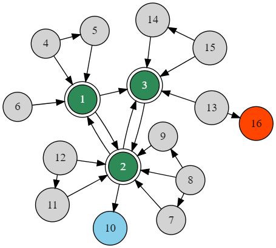
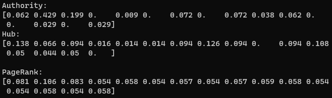
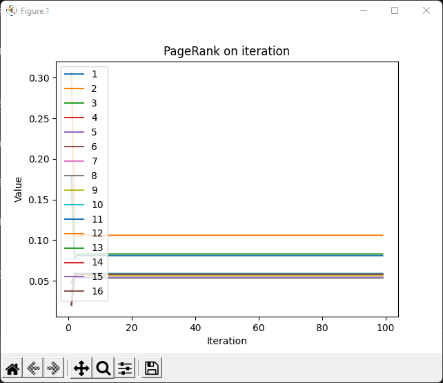
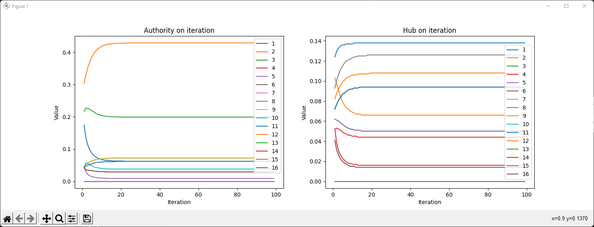
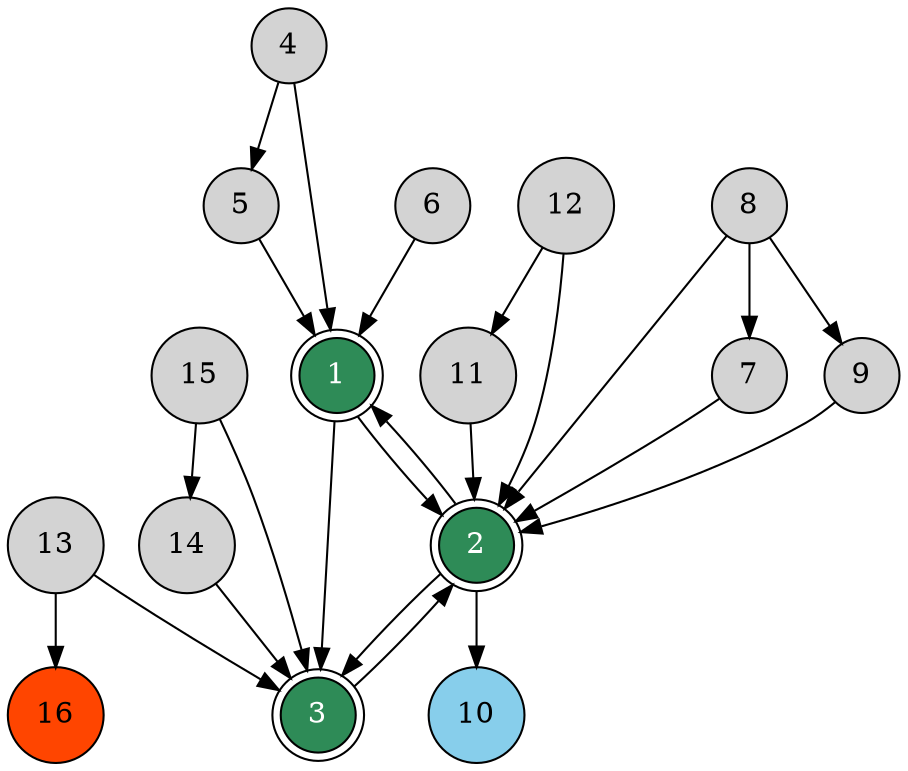

# PageRank and HITS ranking algorithms in Python

Python code for computing PageRank and HITS ranking algorithms for a specific hyperlink structure.

<p align="center">
    
</p>

A detailed description of the algorithms can be found on the following pages:

- [PageRank](https://en.wikipedia.org/wiki/PageRank)
- [HITS](https://en.wikipedia.org/wiki/HITS_algorithm)

The code was inspired by the [PageRank-HITS-SimRank](https://github.com/chonyy/PageRank-HITS-SimRank) project.

## Features

* Save the results for each iteration in text files.
* Create a graph for iterations.
* Create a graph for a specific hyperlink structure.

## Requirements

* Install Python3 from https://www.python.org/downloads/
* Install the required modules for Python using the `pip` tool:
  
```
pip install numpy
```

If you want to create graphs using Matplotlib install packages:

```
pip install matplotlib
pip install networkx
```

for Graphviz install software from https://graphviz.org/download/ and package:

```
pip install graphviz
```


## Installation

Download the repo:
```
git clone https://github.com/mariuszduka/PageRank-HITS
```

Run the program with dataset provided and **default** values for *damping_factor* = 0.85 and *iteration* = 100

```
python main.py -f 'data/graph_1.txt'
```

Run program with dataset and custom parameters

```
python main.py --input_file 'data/graph_1.txt' --damping_factor 0.15 --iteration 500
```

Program parameters:

```
-f or --input_file - file with dataset, default: data/graph_1.txt
--damping_factor - damping factor, default: 0.85
--iteration - the number of iterations of the algorithm, default: 100
--save-iterations - output to files in result folder, default: yes
--draw-iterations - create a graph for iterations, default: no
--draw-graphmat - create a graph using Matplotlib, default: no
--draw-graphviz - create a graph using Graphviz, default: no
--graphviz-dot-file - Graphviz DOT file, default: doc/graph_1.gv
```

More information about the *damping factor* you can find [here](https://en.wikipedia.org/wiki/PageRank#Damping_factor).

## Usage

Create a hyperlink structure in the text file. Write information about linking pages on each line. For example, if page 1 links to pages 2 and page 3, write on two lines: `1,2` and `1,3`, etc. See the graph representing the structure of the hyperlinks at the top of the page.

Example hyperlink structure (`data/graph_1.txt`):

```
1,2
1,3
2,1
2,3
2,10
3,2
4,1
4,5
5,1
6,1
7,2
8,2
8,7
8,9
9,2
11,2
12,2
12,11
13,3
13,16
14,3
15,3
15,14
```

In the console, execute the command:

```
python main.py -f 'data/graph_1.txt'
```

Results in the console:



Output to files in the result folder (`result/graph_1`):

```
graph_1_HITS_authority.txt
graph_1_HITS_authority_iteration.txt
graph_1_HITS_hub.txt
graph_1_HITS_hub_iteration.txt
graph_1_PageRank.txt
graph_1_PageRank_iteration.txt
```

## Graphical presentations

### Structure of hyperlinks

To create a graph showing the structure of hyperlinks using Matplotlib, in the console, execute the command:

```
python main.py -f 'data/graph_1.txt' --draw-graphmat yes
```

The image file will be created in output directory (`result/graph_1`):

```
graph_1_graph.png
```

### Iterations

To create a graph for iterations, in the console, execute the command:

```
python main.py -f 'data/graph_1.txt' --draw-iterations yes
```

**PageRank iterations**



**HITS iterations**




## Graphviz visualization

You can use Graphviz to present the structure of hyperlinks. Graphviz is open source graph visualization software. Graph visualization is a way of representing structural information as diagrams of abstract graphs and networks.

### Online

Use the online tool at https://edotor.net

Example structure of hyperlinks for Graphviz (`doc/graph_1.gv`):


[Graphical presentation of the above code in the Edotor.net](https://edotor.net/?engine=fdp?engine=fdp#digraph%20finite_state_machine%20%7B%0A%09%0A%09node%20%5Bshape%20%3D%20doublecircle%20style%20%3D%20filled%5D%0A%0A%20%20%20%201%20%5Bfillcolor%20%3D%20seagreen%20fontcolor%20%3D%20white%5D%0A%20%20%20%202%20%5Bfillcolor%20%3D%20seagreen%20fontcolor%20%3D%20white%5D%0A%20%20%20%203%20%5Bfillcolor%20%3D%20seagreen%20fontcolor%20%3D%20white%5D%0A%0A%20%20%20%20node%20%5Bshape%20%3D%20circle%20style%20%3D%20filled%5D%0A%0A%20%20%20%201%20-%3E%202%20%0A%20%20%20%201%20-%3E%203%0A%20%20%20%202%20-%3E%201%0A%20%20%20%202%20-%3E%203%0A%20%20%20%203%20-%3E%202%0A%20%20%20%204%20-%3E%201%0A%20%20%20%204%20-%3E%205%0A%20%20%20%205%20-%3E%201%0A%20%20%20%206%20-%3E%201%0A%20%20%20%207%20-%3E%202%0A%20%20%20%208%20-%3E%202%0A%20%20%20%208%20-%3E%207%0A%20%20%20%208%20-%3E%209%0A%20%20%20%209%20-%3E%202%0A%20%20%20%2010%20%5Bfillcolor%20%3D%20skyblue%20fontcolor%20%3D%20black%5D%0A%20%20%20%202%20-%3E%2010%0A%20%20%20%2011%20-%3E%202%0A%20%20%20%2012%20-%3E%202%0A%20%20%20%2012%20-%3E%2011%0A%20%20%20%2013%20-%3E%203%0A%20%20%20%2016%20%5Bfillcolor%20%3D%20orangered%20fontcolor%20%3D%20black%5D%0A%20%20%20%2013%20-%3E%2016%0A%20%20%20%2014%20-%3E%203%0A%20%20%20%2015%20-%3E%203%0A%20%20%20%2015%20-%3E%2014%0A%7D)

### In the console

If you have installed Graphviz on your computer, you can execute the command in the console:

```
python main.py --draw-graphviz yes --graphviz-dot-file 'doc/graph_1.gv'
```

## License

MIT License